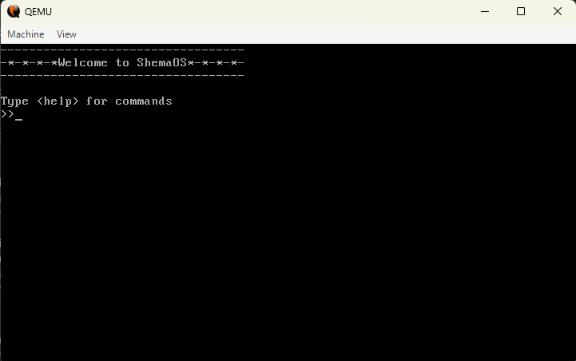

# Project Documentation: ShemaOS

     A custom x86 operating system built from scratch

## Screenshot

## 1. Introduction  
This is my first attempt at building an operating system. I started this project cause i wanted to challege myself and also out of curiosity about how computers work, how they start up, and how much control a user truly has over their machine.  

This OS project represents the **first phase of a two-part journey** to eventually build my own computer from the ground up. Currently, I’m focusing on the software side—creating an operating system—since I don’t yet have the materials to build physical hardware. Once this OS is complete and functional, I plan to design and build a **custom physical computer** to house and run it.

---

## 2. Goals & Objectives  
- Understand the **boot process** and low-level system operations  
- Build a working **bootloader**, **kernel**, and basic **shell**  
- Learn the fundamentals of **memory management**, **interrupts**, and **protected mode**  
- Prepare the OS to be portable to **custom hardware** in the future  

---

## 3. Project Phases  

### **Phase 1: Operating System Development**  
- Write and chain-load bootloaders  
- Enable A20 line and switch to protected mode  
- Load and execute a simple kernel  
- Implement basic drivers and file I/O  
- Impliment user programs

### **Phase 2: Custom Hardware Development**  
- Design the computer’s hardware architecture  
- Interface the hardware with the OS  
- Optimize the OS for the custom machine  

---

## 4. Development Tools  
| Category | Tools / Technologies |
|-----------|----------------------|
| **Languages** | Assembly, C |
| **Assembler / Compiler** | NASM, GCC |
| **Emulator / Testing** | QEMU |
| **Editor** | VS Code |
| **Version Control** | Git + GitHub |

---

## 5. Learning & Research Sources  
- [OSDev Wiki](https://wiki.osdev.org) 
- [DEV Community](https://dev.to)
- Tutorials on x86 architecture and BIOS interrupts  
- Low-level programming and kernel development guides  

---

## 6. Future Plans  
Once the OS reaches a stable version, I plan to move on to hardware design — starting with a basic CPU simulation and eventually building a **real, physical computer** that runs this OS.  

---

## 7. Author  
**Created by:** [Shema Bruno]  
**Started on:** [october, 2025]  
**Current Version:** v0.1 (Bootloader & Kernel Stage)  

---

> *"This is a fun project driven by curiosity — to understand computers from the inside out, and to eventually build one myself."*
